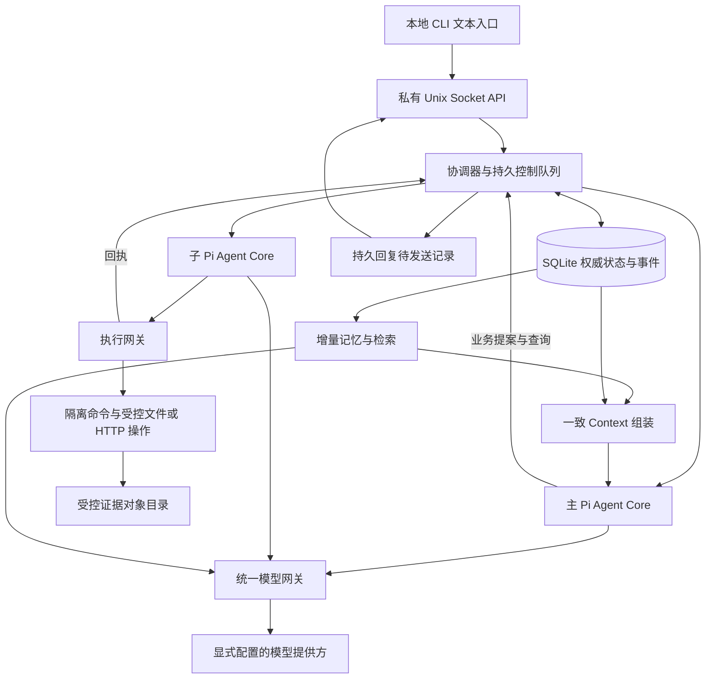

# 总体架构

## 1. 产品契约

Secretary 为一个 Master 保留唯一逻辑主会话。关闭客户端、重启进程和轮换模型执行对象不会改变主会话身份。主会话对话、读记忆、维护认知提案、创建和验收任务；外部检索、命令和文件操作由子会话通过受控执行器完成。

“持续主会话”不意味着模型一直运行或持有无限历史。可恢复的权威数据和可重建的执行视图提供连续性。无需推理的接收确认、取消、撤权与状态查询始终由程序处理。

初版只支持本机文本客户端、一个主推理过程、一个运行子任务。主推理、子任务及记忆整理可以同时等待模型；同一任务内有状态工具串行。普通交互优先于后台整理；模型总并发默认 2。联网检索和通用命令是按资源授权的能力，不要求为每一种业务写专用工作流。

## 2. 权威层次

| 层 | 内容 | 写入者与用途 |
| --- | --- | --- |
| 原始证据 | 用户原文、工具请求与回执、模型完成消息、外部快照 | 可信接入/工具/模型适配器记录；内容不自带授权 |
| 权威业务状态 | 任务及版本、要求/承诺、授权、被接纳事实、执行操作与正式回复 | 协调器短事务；模型只能提出修改 |
| 派生视图 | Consciousness、关键词索引、近期经历、摘要和列表缓存 | 可重建；错误不允许覆盖权威状态 |
| 单次 Context | 一致状态快照、工作记忆、未覆盖事件、当前交互段、检索片段 | 每次调用重组；不作为新的事实来源 |
| Pi 执行状态 | 本轮循环、工具调用配对、临时消息对象 | 可重建/轮换；不成为第二份业务数据库 |

World Model 表示已被接纳的断言及关系，不表示绝对真理。`epistemic` 区分用户陈述、来源观测、已核实；`status` 区分有效、冲突、被取代、撤回。来源无法独立验证时保留该限制。

## 3. 部署与模块

工程默认：TypeScript ESM、Node.js 24.21.0、Pi Agent Core/AI 0.85.1、SQLite。第一版一个 `secretaryd` 协调进程加 `secretary` 客户端；命令执行发生在隔离子进程。大输出处理和数据库工作不得长期占用接收事件循环，可用有界 worker 队列；不引入远程数据库、消息队列或向量服务。已固定研究依赖与发布源码的完整锁，P1 按该基线建立应用锁并重验，禁止动态 `latest`。

同一数据目录只能有一个协调器：启动时取得 OS advisory exclusive lock，之后提升数据库 `owner_epoch`。锁必须由操作系统随进程结束释放，不能只检查 PID 文件或按超时删锁；P1 验证目标平台绑定。每个执行许可和提交都带代际。第二实例不能抢占活跃实例，过期进程的回执只可作为待核查证据接纳。

数据目录归协调器控制，客户端仅用 socket，命令沙箱不能访问数据库、对象库、配置、socket 或凭据。子 Agent 是受信任代码创建的受限工具集合，不加载任务目录的扩展。来自其模型的任何参数仍是不可信输入。

## 4. 正常闭环

1. 客户端持久保留 `request_id` 后提交消息；服务端验证身份及请求，原文对象先可靠保存，再在事务内插入请求和接收事件。成功提交才返回 `ACCEPTED`。
2. 调度器读取持久输入，组装一致 Context。主模型提出任务，协调器校验授权、目标、要求、预算与版本，提交任务版本和派发记录。
3. 派发器创建执行尝试，向子 Agent 提供最小任务包，立即将任务编号返回主会话。主会话可继续处理下一输入。
4. 子 Agent 请求工具。执行网关每次检查资源、授权、代际、取消状态和剩余预算；保存操作意图与许可，然后执行。结果和证据先保存，回执再推进任务。
5. 程序检查文件/目标状态等确定性条件。需要语义判断时，主会话提出验收结论；协调器仅在当前任务版本的全部必要条件满足时提交成功与正式回复。
6. 回复通过持久待发送记录投递；重连可按相同 `reply_id` 重读。工作记忆从新事件增量更新。

完整的事务和崩溃窗口见 [Execution](Execution.md)。

## 5. 全局不变量

| 编号 | 必须保持的规则 |
| --- | --- |
| I01 | `ACCEPTED` 必有持久请求；失败持久化不派发 |
| I02 | 权威修改、对应事件和需要产生的待派发/待回复记录同事务提交 |
| I03 | 模型、检索材料、工具输出不能授予权限；授权来自认证主体及预先批准策略 |
| I04 | 任务成功必须绑定当前任务版本、验收证据及有效验收条件 |
| I05 | 外部动作开始与本地结果提交之间无法原子化；缺证据即 `RESULT_UNKNOWN`，不盲目重试 |
| I06 | 取消/撤权限制新操作；不会倒置已发生副作用，也不把未核查当作已停止 |
| I07 | 要求、承诺、授权、任务不依赖摘要存在；工作记忆水位不跳过未完成事件 |
| I08 | Context 的权威状态、事件切点和派生版本可以追踪；提交提案时重新检查前提 |
| I09 | 所有模型出口及执行器都有硬预算与权限门禁；门禁失败不回退到不受限路径 |
| I10 | 原始内容和验收证据绑定稳定对象版本；回放不得执行外部动作 |
| I11 | 客户端接收确认、主模型推理结束、任务完成、回复送达分别记录 |
| I12 | 当前文档/Schema/DDL 检查只产生 DOC_ONLY 证据 |

## 6. 扩展边界

P7 的定时/条件唤醒使用持久订阅、到期实例唯一键和 catch-up 策略；采用与用户请求相同的持久输入和总预算。它们不能自动扩大授权，无法履行的未来承诺在初版显示为待处理且明确说明尚无自动唤醒。

多任务增加资源锁/冲突调度、每任务公平配额；多客户端复用同一逻辑会话和持久排序，客户端标识不成为新的主会话。语音/视觉只增加输入适配器与对象类型，必须继承数据分类和来源。上述扩展分别通过验收，不因本版预留字段而标记实现。
