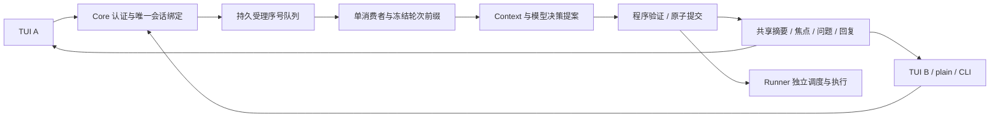

# Secretary Simplified：当前架构 v1.1

本版落实 GitHub Issue #2；原始六步设想完整保存在 [Design2-v0.1.md](archive/Design2-v0.1.md)，仅用于历史溯源。

Secretary 在一个数据目录内维护一个稳定的 instance_id 和唯一 MASTER 权威会话。所有 TUI、plain chat、命令式 input 与类型化入口绑定后端会话，客户端只保存草稿、显示缓存与待查询请求标识。重新打开终端不创建会话，退出终端不停止 Core、Runner 或任务。

输入受理与认知提交分别编号。后到输入不能提前进入前轮 Context 或使前轮认知版本失效；摘要只能覆盖已处理边界。后台任务、事实、回执仍由原业务服务持有权威，模型与前端均不能直接修改。

已有数据库通过追加迁移显式选定一个原 MASTER 会话；其他会话保留只读历史，内部会话不得被选为主会话。禁止自动合并历史、重写幂等哈希或降低分类。新库初始化登记唯一身份，不再提供会话创建与切换。

TUI 使用异步本机 HTTP 请求和独立输入区，支持中文多行、粘贴、滚动、结构化问题回答及带目标与版本确认的控制操作。超时表示仍待确认，查询和重试沿用原 request_id。保留命令式 CLI、JSON 和非 TTY 路径。

完整规范与序列/状态图见 [SingleConversationTUI.md](SingleConversationTUI.md)，接口见 [Interfaces.md](Interfaces.md)，存储见 [Storage.md](Storage.md)。当前验收只包括 Issue #2 AUTH/TUI/DOC/BUILD；既有长期与模型报告是原构建的历史证据。下一阶段由 Master 接入获授权的真实文本，来源同步与其他数据范围另行明确。
