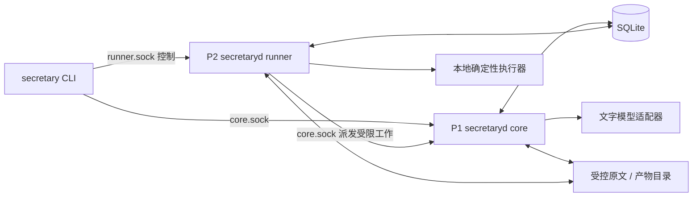

# 程序架构与依赖

## 1. 物理部署

阶段 3 交付一个 Go module、两个二进制、两个常驻进程、一个本机 SQLite 数据库和一个受控产物目录。Core 与 Runner 来自同一个 `secretaryd` 二进制的不同启动模式；CLI 二进制为 `secretary`。内置 agent 是 Core 中的受限执行循环，不额外部署第三个常驻服务。

P1 故障时 P2 可扫描已提交计划并执行本地能力；需要 P1 的 agent 工作保留排队或按策略超时，不能标记成功。P2 故障时 P1 可受理输入并登记计划，但界面显示执行器离线。两个进程都停止时没有执行保证。

阶段 5 增加 P3 audio-worker；阶段 6 增加移动客户端和经认证的连接入口。新增入口不能改变业务命令、去重和授权语义。Mac 图形客户端是可选扩展，不阻塞阶段 1—4。

## 2. 源代码分组

以下是 14 个职责包组，可以在组内拆文件和子包，不作为 14 个独立发布的库。

| 包组 | 职责 | 主要依赖方向 |
|---|---|---|
| `contract` | 版本化 DTO、枚举、Schema 校验 | 不依赖业务包 |
| `store` | SQL、迁移、事务、版本与事件 | contract |
| `policy` | 授权、披露、预算、最终许可 | contract、store |
| `ingest` | 适配器、原文、去重、结构化输入 | contract、store |
| `world` | 事项、观测、事实准入与投影 | policy、store |
| `memory` | 意识快照、会话摘要、检索 | world、store |
| `context` | 只读快照、预算、输出 Schema 注入 | memory、world、policy |
| `model` | 服务商协议、调用记录、结构化返回 | contract；不直写业务表 |
| `core` | 输入轮次、决策校验、委托与验证 | context、model、world、policy |
| `scheduler` | 持久扫描、触发去重、租约、恢复 | store、policy |
| `executor` | 能力登记、本地执行、Core 工作桥接 | contract、policy；不依赖 context/model |
| `transport` | UDS HTTP、认证、错误与流式事件 | contract；注入服务接口 |
| `platform` | 时钟、文件、Mac 设备适配 | 标准库优先 |
| `diagnostics` | 日志、报告、只读回放 | contract、store 的只读接口 |

入口目录：`cmd/secretaryd`、`cmd/secretary`。测试：`tests/fixtures`、`tests/integration`、`tests/replay`。运行时目录：`state/secretary.sqlite`、`objects/`、`logs/`、`reports/`、`run/`；实际路径由配置给出，示例使用隔离临时目录。

P1/P2 共享受控 store 实现。通过接口分出 CoreStore、RunnerStore、WorldCommitStore，禁止在任意业务包手写跨归属表 SQL。SQLite 本身不提供进程级表权限；该边界属于代码和进程信任边界，恶意宿主用户不在隔离保证内。

## 3. 外部依赖

主体只采用 Go。首批第三方运行库限两项：纯 Go SQLite 驱动 `modernc.org/sqlite` 和支持 JSON Schema Draft 2020-12 的校验库 `github.com/santhosh-tekuri/jsonschema/v6`。标准库完成 HTTP、JSON、日志、进程、UUID 随机字节与配置。初版周期规则采用结构化 `once/interval/daily/weekly/event`，暂不接入通用 cron DSL，因此没有 cron 库依赖。

这些是接口级选型；实施开始时查询官方仓库、固定兼容的 Go/库版本并保存 go.mod/go.sum 和依赖清单。不能直接沿用旧实验版本并称其为当前安全版本。若库不支持本文 Schema 所需能力，选择同类替换并记录理由；不得删除校验规则迁就库。接口依据：[modernc SQLite 文档](https://pkg.go.dev/modernc.org/sqlite)、[jsonschema 官方仓库](https://github.com/santhosh-tekuri/jsonschema)。

检索先用 SQLite 索引、实体引用和普通全文字段匹配。FTS5 可作为优化，但安装环境不支持时必须保留基础检索。初版无需向量数据库、Redis、消息中间件、ORM 或 Python 运行服务。

## 4. 并发与队列

默认 P1 即时模型调用并发 1，后台模型调用并发 1；模型服务商全局并发上限默认 1，已在运行的后台请求不抢占，须有 60 秒请求超时。即时工作优先获得下一可用调用槽。P2 本地执行并发 2，单个计划默认不重叠。各队列容量默认 100；容量满返回可重试 BACKPRESSURE，不丢输入、不无界启动 goroutine。

输入先持久化再受理。未完成的输入轮次由 P1 扫描恢复。P2 扫描周期默认 1 秒；Core 事件消费者周期 1 秒。停止、取消控制走独立有界控制通道，不等待模型或普通任务工作槽。

每个进程一个写入串行器，跨进程仍依赖 SQLite 事务和条件更新。读连接数量默认 4；每个连接都初始化外键、busy timeout 等配置。不得在事务中执行网络调用、模型调用、播放或长时间文件处理。

## 5. 启停

首次初始化独占迁移锁；迁移只在两个常驻进程停止时运行。服务启动验证迁移版本，版本不匹配即退出并给出修复说明。P1/P2 各持有独占实例锁；Runner 另使用数据库代际和执行租约防止旧回执覆盖新状态。

阶段 3 用进程启动器完成测试，可交付用户级 launchd 配置但默认不安装、不自启。阶段 4 启用常驻前记录 Master 选定配置。重启先对账旧执行，再领取新副作用任务。
