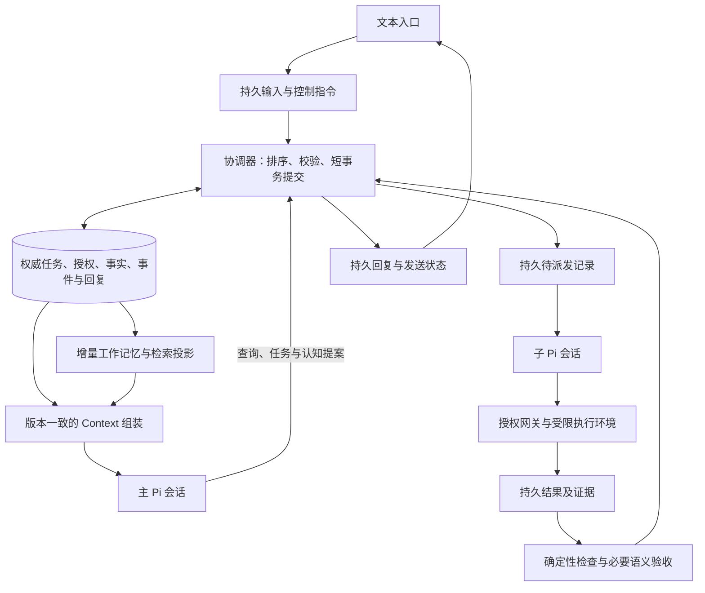

# Secretary 新计划与架构评审

评审日期：2026-09-18（Asia/Hong_Kong）
评审对象：`1167fae73dcb6def987a9bbe190a167407b5ce8c` 的 [PLAN.md](archive/PLAN-2026-09-17.md)
结论：方向合理，可以进入 P0/P1；关键提交与执行契约补齐前，不宜视为完整实施规格。

本文是评审建议，不代表架构决策已经批准，也不代表任何阶段已经实现。

## 1. 检查范围与总体判断

本次已克隆指定仓库，克隆完成时本地 `main` 与 `origin/main` 均为上述提交。该提交的文件树只有 `README.md` 和 `PLAN.md`。前一提交 `53c3b95` 明确重置了旧实现，因此旧版 Go 程序、测试结果及设计附件均不作为新版实现或验收证据。

已完整检查计划，另外静态阅读 Pi 官方源码，固定参考提交为 `a8b3dd19983883be2907253e566dd52989aee936`。这只是本次评审的上游快照，不是替项目选定运行版本。未安装或运行 Pi、未调用真实模型；当前仓库没有可以执行的新版程序测试。源码观察与下面的风险推断分开陈述。

计划已经正确处理了以下核心问题，应当保留：

- 唯一逻辑主会话与具体进程、Pi 会话对象分离；主会话负责协调，子会话承担外部操作。
- 原始记录、权威任务/授权/事实、派生工作记忆、本次 Context 各有边界。
- 接收、执行、验收分离；显式表达取消中的副作用和结果不确定，不承诺任意外部操作都只执行一次。
- 增量整理原始事件，保留连续处理位置，防止旧检索材料循环变成新证据。
- 先证明小闭环，再加入事实记忆、工作记忆和历史退出；程序机制与模型行为分别验收。

主要欠缺在工程契约，而非需要重做上述方向。计划已经提及的一致性、授权、恢复和预算，下文要求补的是具体提交点、拒绝条件和验证方法，不能把它们误报为完全没有考虑。

## 2. 必须补充的设计与步骤

### R1：明确 Pi 接入点的失败语义，不能只验证正常路径

**优先级：P1 通过前。** 对应计划第 5.5 节及 P1。

源码观察：Pi 的 `context` 扩展可以改写本轮消息，但扩展执行器会捕获处理器异常、记录错误，再返回当前消息；`before_provider_request` 也有类似处理。因此，仅在这些扩展中抛出“预算不足”或“禁止发送”的异常，不能据此证明请求一定被阻断。[Pi 扩展执行器](https://github.com/earendil-works/pi/blob/a8b3dd19983883be2907253e566dd52989aee936/packages/coding-agent/src/core/extensions/runner.ts#L1072-L1135)

**风险推断：** 如果把必要状态组装、隐私检查或硬预算全部放在这些钩子里，失败时可能继续发送未通过检查的输入，与计划第 5.3 节的暂停要求冲突。

建议 P1 增加接口能力表：哪些入口能改写输入、等待落盘、真正阻断 provider 调用、终止工具、恢复历史；记录顺序、异常传播及自动重试行为。用可计数的模拟 provider 验证“组装失败/越限/禁止外发时请求数为零”。硬门禁应在经过验证、能够终止发送的适配层实现；SDK 扩展还是更底层 Agent 接入，由实验选择。

### R2：明确唯一持久权威，以及接收、派发、回执、回复的提交边界

**优先级：P1 验证接口，P2 固化协议。** 对应计划第 3.2、4.2、4.3、8 节。

源码观察：Pi `AgentSession` 的普通事件订阅分发不等待订阅者返回的 Promise，且 `message_end` 对订阅者的通知发生在其会话记录追加之前。新建且尚未首次刷出的会话，在没有助手消息时，默认文件持久化路径会推迟首次写入。[事件分发](https://github.com/earendil-works/pi/blob/a8b3dd19983883be2907253e566dd52989aee936/packages/coding-agent/src/core/agent-session.ts#L604-L705)、[会话保存](https://github.com/earendil-works/pi/blob/a8b3dd19983883be2907253e566dd52989aee936/packages/coding-agent/src/core/session-manager.ts#L1040-L1073)

**风险推断：** “收到 Pi 事件”及 `subscribe(async …)` 都不能直接替代 Secretary 的持久化确认；Pi 会话文件和业务库独立写入，也不能天然形成跨存储事务。

建议默认由 Secretary 的存储承担请求、任务、授权、结果和对话连续性的权威；Pi 运行历史是可重建的执行视图。Pi 提供从外部保存的 entries 构造内存会话的入口，可作为 P1 的候选方案。[SDK 恢复入口](https://github.com/earendil-works/pi/blob/a8b3dd19983883be2907253e566dd52989aee936/packages/coding-agent/docs/sdk.md#L793-L796)

至少补齐以下协议：

1. 请求与接收记录提交成功后，才返回接受确认；失败时不得派发。
2. 任务/执行尝试与“待派发”记录同事务提交；派发者可重试读取，接收端按稳定标识去重。
3. 外部动作开始前保存操作意图；动作结果、证据和任务推进有明确恢复路径，外部动作与本地事务之间的空窗进入“结果不确定”。
4. 结果验收、任务终态和待发送回复同事务提交；断连后可以重发或查询既有回复，无须重跑任务。流式片段与正式回复明确区分。
5. 区分 `request_id`、`task_id`、`attempt_id`、`operation_id`、`receipt_id`、`reply_id`。同一外部操作跨尝试重试时，不能仅因换了 `attempt_id` 就换掉目标系统的幂等标识；仍须服从目标的幂等有效期与查询能力。

数据库中的待派发/待回复表足以承担初版队列，不必因此引入外部消息系统。需明确故障模型：进程崩溃、操作系统重启及断电的持久性要求分别是什么。

### R3：补主会话调度、旧结果拒绝和任务修改协议

**优先级：P2；P3 验证。** 对应计划第 2.1、4.1、4.2 节。

“主状态有序提交”仍需回答：主模型正在推理时，取消、撤权、新约束和子任务回执怎样生效。若派发工具一直等待子任务结束，或整个模型调用持有状态提交锁，主会话会被阻塞；若放开更新而不校验版本，旧模型输出又可能覆盖新指令。

建议采用持久输入队列与短事务协调器：派发接口返回任务编号，子任务结果作为后续事件进入；同一时刻最多一个主模型生成过程，输入接收、取消、撤权、状态查询由程序持续服务。自然语言输入何时排队、何时中断当前轮，应有明确规则和响应时限。

每次模型提案携带读取的任务/事实/授权版本与事件边界，提交时检查相关前提是否仍成立；任务目标、约束和验收条件的修改需要新版本。旧结果可保留为历史证据，但不能按旧条件宣布新版本任务完成。取消后的在途副作用仍需独立核查。

即使初版只运行一个子任务，也要处理工具级并发。所查 Pi 的 `Agent` 默认是 `parallel`，同一助手消息可并行执行多个工具。[默认值](https://github.com/earendil-works/pi/blob/a8b3dd19983883be2907253e566dd52989aee936/packages/agent/src/agent.ts#L244-L252)、[执行分支](https://github.com/earendil-works/pi/blob/a8b3dd19983883be2907253e566dd52989aee936/packages/agent/src/agent-loop.ts#L464-L478)

初版可显式串行化有状态工具；状态库仍做版本检查。重复启动需拒绝第二个协调器；如允许执行者跨协调器重启存活，还需执行代际或租约 fencing，拒绝旧执行者继续提交。模型调用期间的取消测试应前置到 P2/P3，而非等 P7 多客户端。

### R4：把资源隔离变为运行边界，并验证隔离失败时拒绝执行

**优先级：P1 验证方案；P3 写入/命令任务前通过。** 对应计划第 2.1、4.2 节及 T05。

源码观察：Pi 默认读取工具直接访问本机文件，默认 shell 工具在宿主机启动进程，设置 `cwd` 没有建立文件访问沙箱。扩展自动发现还可能引入额外执行代码；可信项目机制不等同于 Secretary 的任务授权。[读取实现](https://github.com/earendil-works/pi/blob/a8b3dd19983883be2907253e566dd52989aee936/packages/coding-agent/src/core/tools/read.ts#L44-L47)、[shell 实现](https://github.com/earendil-works/pi/blob/a8b3dd19983883be2907253e566dd52989aee936/packages/coding-agent/src/core/tools/bash.ts#L81-L102)、[SDK 默认资源加载](https://github.com/earendil-works/pi/blob/a8b3dd19983883be2907253e566dd52989aee936/packages/coding-agent/src/core/sdk.ts#L176-L188)

上游沙箱**示例**在未启用或未初始化时回退到本地 bash，初始化异常会将启用标记置为 false；不能直接将该示例作为本项目的强制隔离保证。[示例回退与初始化](https://github.com/earendil-works/pi/blob/a8b3dd19983883be2907253e566dd52989aee936/packages/coding-agent/examples/extensions/sandbox/index.ts#L214-L283)

建议补实际部署图：协调器/主库、子会话执行环境、工具网关、凭据、模型出口分别处于何种信任边界。只读阶段可用受控文件读取；开放通用命令前，选定并验证操作系统级隔离或等效的受限执行环境。独立进程但同一用户权限，并不自动隔离文件和凭据。

测试至少覆盖：绝对路径与符号链接逃逸、对主库/配置/代码的修改、非授权凭据或网络访问、子进程残留、隔离初始化失败、项目文件诱导扩展加载。敏感操作需要可信执行上下文中的主体与授权，不能接受模型自行填写身份。读取并外发数据也属于权限范围，不能只检查写入。

### R5：为要求、承诺和记忆语义遗漏增加保障

**优先级：P2 预留权威引用；P4/P5 实现并验收。** 对应计划第 3、5.1、5.3、5.4 节及 T08/T10。

计划已要求未完成事项持久化，但候选数据对象尚未明确如何表示未变成任务的承诺、等待 Master 回答的问题，以及跨任务长期有效的约束。工作记忆“处理到事件 N”也只能证明处理进度，不能证明模型没有漏掉事件中的一条要求。

例如：“先检查配置，今天不要重启，等我确认再做。”如果摘要只保存“检查配置”，字段结构和游标都可能合法，但后续行为已不符合要求。

建议明确要求/承诺/待决事项的权威归属，可以是任务子记录或统一义务记录，无须为每类单独建服务。至少含来源、作用范围、有效状态、解决/取消依据；验收条件不能被模型自行放宽。

工作记忆记录源事件范围和引用；历史退出前检查已知关键约束、未决事项及工具配对的覆盖。对尚未结构化的自然语言要求，保留原始证据或待审片段，并用带标准答案的场景测遗漏率。第二个模型复核可以辅助，但不能作为无遗漏的证明。整理错误需要可定位和重建；不能因为结构校验通过就自动声明语义完整。

还应规定：事实纠正后，检索索引、工作记忆缓存、在途 Context 和任务提案如何失效或重新校验；多条转述同一原始来源不能算多个独立证据。事实的适用时间、实体歧义、冲突与仅未知应可区分。

### R6：把最小预算与停机机制前置，补跨调用总预算和积压处理

**优先级：P1/P2 建最小机制；P5/P6 完善策略。** 对应计划第 4.1、5.2、5.3 节及 P6。

计划当前把完整预算主要放在 P6，然而 P3 的真实文件读取和命令任务就可能产生超大输出。已有的单次执行尝试上限，也不能限制主会话反复新建尝试、记忆整理持续失败、Pi 自动重试与应用重试叠加。

建议前置以下最小机制：

- 每次实际模型请求的长度/输出预留门禁，主会话、子会话、整理、验收及压缩等辅助调用全部覆盖；保存配置和最终发送载荷的受控追踪信息。
- 工具输出的字节/时长/存储上限，有界预览与持久内容引用；流式输出也受限。
- 一个用户请求下共享的总时限、调用/重试次数和成本预算，新建尝试不重置总额度；规定程序重试与 Pi 重试分别负责哪些错误。
- 记忆整理积压与坏事件处置：限次重试、保留缺口、人工处理或明确失败记录；不能偷偷越过未完成事件推进连续水位。
- 必需上下文放不下时进入可见暂停，状态查询、取消、撤权仍能工作；模型或记忆服务不可用时也保留这些控制能力。

P6 再做稳定规模、优先级衰减和长期成本优化。Consciousness 不应以一个不断增长的大对象整体注入；可检索的派生内容与本轮必须携带的工作集需要分开。

### R7：补证据对象的生命周期与整套数据恢复

**优先级：P2 定义；P3 首次证据闭环和每次持久结构升级前验证。** 对应计划第 3.1、4.1、7.4、9 节。

“结果引用”或“证据入口”如果只是测试目录中的文件路径，文件修改、临时目录清理或备份恢复后就可能指向不同内容或失效。数据库恢复正常，也不等于原始正文和证据对象仍然可用。

建议定义最小证据对象：稳定标识、内容版本或哈希、来源/采集时间、大小、分类与保留状态。验收应绑定已观察到的具体版本；对不可快照的外部状态记录观测时间和局限，不能将路径存在等同于证据可验证。

数据库引用只能提交到已可靠保存的对象；对象保存后数据库事务失败所留下的孤儿应可清理。备份清单应包括权威库、引用对象、配置版本和恢复所需信息；凭据单独管理。派生索引可重建。

计划第 9 节已列保存策略、第 3.2 节已列迁移，但缺少明确实施及验收阶段。补：一致性备份、恢复演练、迁移失败处理、磁盘不足/对象缺失、正常关闭与紧急停止。恢复旧备份后，对可能已在外部发生的动作重新核查，不能按旧待执行状态自动重放。

“遗忘不删除原始证据”是记忆策略；Master 主动删除资料属于另一条数据生命周期。其对原文、事实、摘要、索引、调试快照及备份的影响应有单独政策；这是进入真实资料试运行前的决策，不必阻塞合成数据原型。

### R8：将架构基线、工程产物与验收证据纳入计划

**优先级：P0/P1 补基线与实验产物；P2 起持续执行。** 对应计划第 1、6、7、9 节。

计划第 5 行依赖“2026-09-16 记忆体系基线”，但当前文件树没有该原文或固定引用；因此本次无法核实计划是否完整继承了那次决策。建议加入精简的基线与决策记录，标注“已定原则、候选方案、被替代决定”。以当前计划的增量工作记忆语义为评审依据，不自动套用旧实现的更新周期或技术栈。

建议补齐少量可交接产物，而非先写庞大的设计手册：

| 产物 | 内容 | 首次交付 |
| --- | --- | --- |
| 架构基线与决策记录 | 权威边界、信任边界、主子会话调度、与旧设计的关系 | P0/P1 |
| Pi 适配实验 | 固定提交、依赖锁定、可运行脚本、通过/失败证据及接入决策 | P1 |
| 状态与提交协议 | 版本化数据契约、状态转换表、提交点、崩溃位置与恢复动作 | P2 |
| 可重复验收入口 | 模拟模型/时钟、隔离数据、故障注入、回归命令、证据清单 | P2 起 |
| 运维与试运行说明 | 启停、状态查询、备份恢复、迁移、数据策略、试运行退出条件 | P3 起；真实数据前补全 |

确定性测试和模型测试应有独立运行入口，CI 默认不依赖真实模型。模型验收记录模型标识、配置、提示词/策略版本、上游提交、样本集版本和实际成本。主模型验收子模型的语义结果，不应再由同一流程自报通过作为唯一评测依据；保留独立标准和人工抽查。

计划已有留出集及阈值冻结要求，应在产物中落实。将“回放已有事件重建状态”与“重新调用模型/工具”分成不同模式，评审与调试回放默认不能重做外部副作用。

## 3. 建议的最小架构轮廓

下面表示职责及数据流，并非要求每个框独立部署。初版可以保留一个协调进程、一套数据库和一个受限执行环境。

协调器拥有状态提交权；模型输出是带版本前提的提案。派发、取消和资源访问由程序落实，工作记忆可重建，主会话连续性不依赖一直保留某个 Pi 对象。需要语义验收时由主会话产生判断提案，正式成功仍走提交协议。

## 4. 对实施顺序的具体调整

保留 P0→P7 的总体顺序，只增加提前完成的门槛：

| 阶段 | 增补动作 | 通过条件 |
| --- | --- | --- |
| P0 | 纳入 9 月 16 日基线；明确状态归属、信任边界与故障模型；区分合成数据和真实资料授权 | 没有相互冲突的“权威”；验收样例可判断行为 |
| P1 | 验证持久化屏障、上下文门禁失败、隔离失败、工具并发、压缩/重试入口；建立最小请求预算 | 关键失败路径有实验结果，不能只证明 SDK 正常调用 |
| P2 | 落实输入/派发/回执/回复协议、任务修改版本、总预算、证据对象、备份恢复与模拟回归入口 | 每个关键提交空窗都有预期恢复动作，重复处理不重复推进 |
| P3 | 先只读；隔离和外部操作恢复测试通过后开放受控写入/命令；验证主模型忙时取消与撤权 | 新指令及时生效，旧提案不能覆盖新状态；已提交回复可查询 |
| P4 | 增补事实来源独立性、实体与时间语义、纠正后的派生视图失效 | 当前查询与历史查询语义明确，纠正可传播 |
| P5 | 增补要求/承诺覆盖、语义遗漏检测、积压/坏事件恢复与一致快照组装 | 游标、摘要和关键要求均经检查，暂停仍可人工控制 |
| P6 | 多次退出与长时回放，统计主/子/辅助调用总成本及存储增长 | 控制实际请求和工作集；连续性与恢复通过留出集 |
| P7 | 分拆定时、多任务、多客户端、媒体的独立门槛；增加受控真实使用观察期 | 每项扩展单独提供证据，真实故障回归且可停止/恢复 |

不需要为了“完整”提前加入向量库、多服务部署、复杂遗忘评分或多子任务并发。当前最划算的下一步是把 P1 做成有明确失败判定的集成实验，再冻结 P2 的持久协议。

## 5. 建议追加的验收用例

以下补充原 T01—T14，不替代原有场景。编号为评审建议。

| 编号 | 场景 | 预期不变量 | 阶段 |
| --- | --- | --- | --- |
| T15 | 新会话首条请求已确认，第一条模型回复前崩溃 | 请求和身份可恢复，确认不依赖 Pi 首次助手记录 | P1/P2 |
| T16 | Context 或外发策略检查失败；provider 请求钩子异常 | 未通过硬门禁的模型调用数为零 | P1 |
| T17 | 主模型计算期间修改目标/验收条件、取消或撤权 | 控制指令及时提交；旧提案不得按旧条件推进新版本任务 | P2/P3 |
| T18 | 单一子任务一轮请求两个写工具；重启时旧执行者仍存活 | 不越过撤权或执行代际；资源冲突有确定处理规则 | P2/P3 |
| T19 | 沙箱初始化失败、路径逃逸、非授权扩展/凭据访问 | 隔离失败拒绝执行，受保护资源实际不可访问 | P1/P3 |
| T20 | 摘要结构合法但遗漏禁止条件、承诺或待决问题 | 覆盖检查/验收能发现；不得仅凭游标推进允许历史退出 | P5 |
| T21 | 大输出、整理坏事件、辅助模型反复失败、新尝试不断创建 | 总预算与积压边界有效；查询、停止和人工恢复可用 | P2/P5/P6 |
| T22 | 成功及回复已提交，发送前后断连 | 可恢复同一回复；不重跑已完成任务，不伪称对方已收到 | P2/P3 |
| T23 | 证据文件被替换/删除、磁盘满、迁移中断、恢复旧备份 | 不接受失效证据；不错误确认持久化；恢复不重放未核查副作用 | P2/P3 |
| T24 | 事实纠正时缓存/摘要滞后，同一来源多次转述 | 使用有效事实或明确冲突；不因转述次数提高证据独立性 | P4/P5 |
| T25 | 进入事件回放与状态重建模式 | 回放不触发真实模型或外部动作；需要重新执行时必须走独立入口 | P2 |
| T26 | Master 请求删除已进入事实、摘要及索引的真实资料 | 删除范围及备份保留遵守明确政策；不能只删除入口原文 | 真实资料前 |

## 6. 需要 Master 决定与可由工程验证的事项

需要 Master 定方向的是：哪些事实/偏好可自动接纳、真实资源和数据外发范围、资料保留/删除与成本容忍度。计划已列出其中不少事项，实施时应集中成少量决策，而非每个字段逐项询问。

SDK 或 Agent 接入、存储表拆分、是否显式串行工具、版本字段名称、测试框架等可以先用实验形成推荐方案。补充架构后按阶段验收即可，无须推翻现有计划。

本次完成的是仓库同步、计划评审及上游源码静态核查。没有新版运行结果，也没有对 Pi 接入、安全隔离、模型表现或长期连续性作通过声明。
