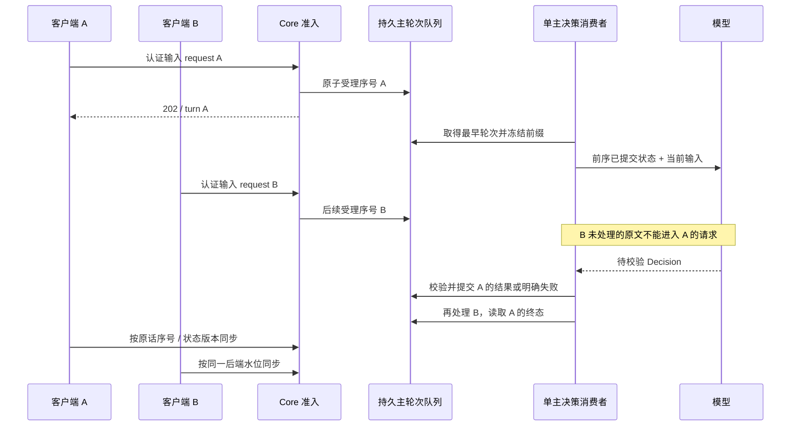
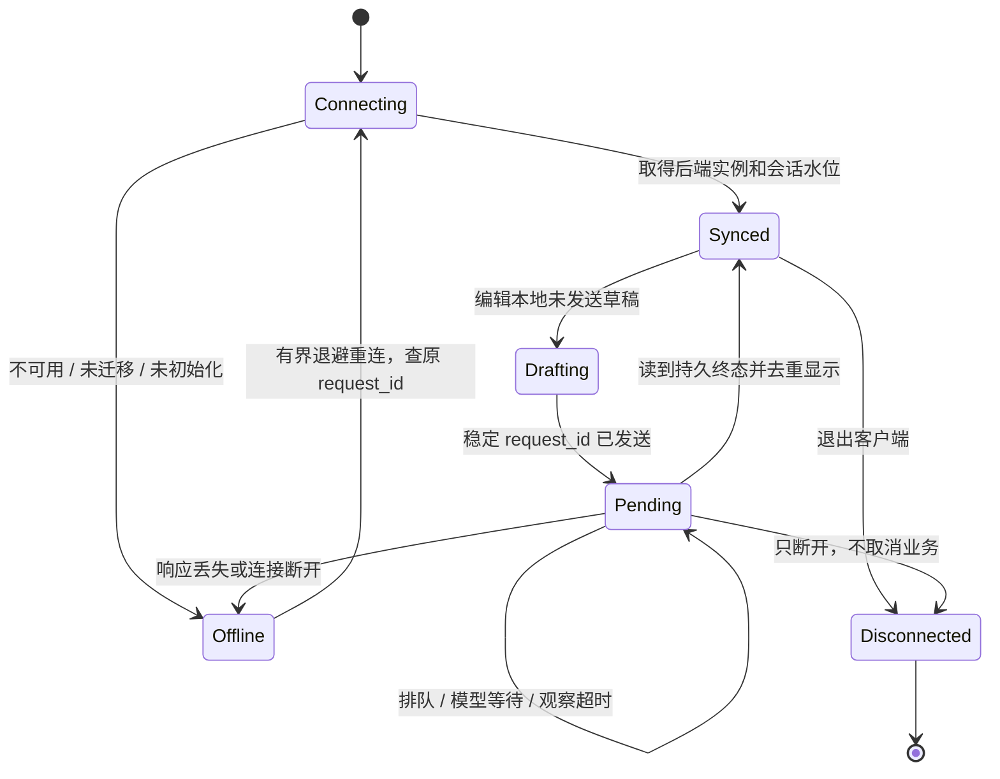

# 单一权威会话与 TUI

版本 1.1，Issue #2 的现行架构与交付规范。原 M1—M3、Issue #1 的报告保留其构建身份；本轮不是重新验收旧上下文和持久状态系统。

## 改造前、改造后与范围

改造前，公共入口可以指定不同 session_id，plain chat 阻塞等待并主要显示 JSON；客户端缺少共同历史和结构化问题入口。改造后，同一正式 Secretary 实例由后端登记唯一可写权威会话，多个认证客户端只是同一秘书的输入与显示终端；默认交互入口为非阻塞 TUI，保留 plain、命令式和 JSON 模式。

客户端可以保存未发送草稿、滚动位置和最后已读水位，不能上传主历史/摘要来覆盖后端。唯一会话维护统一摘要、焦点和问题；World、Live、Consciousness 继续按原权威边界维护。共享上下文意味着共用服务端认知来源和 Context Builder，不要求无限 prompt，也不要求后台任务与主对话逐字使用同一模型输入。

范围限两个本机客户端连接同一 Core/Runner。没有新建会话、切换会话、会话选择器或 `/new`；不实现手机配对/远程网络、真实来源同步、通用 Agent 平台、语音或新业务能力。

## 身份与旧记录

- `instance_id`：后端持久登记的正式实例身份；不同隔离目录独立，不自动合库。
- `session_id`：后端唯一可写主会话。正常客户端查询获得，不自行创建；公共入口省略时后端补齐，显式提供非权威 ID 拒绝。
- `request_id`：提交前创建并保留的幂等键。响应丢失先查询原键，不能换键自动重发。相同文字的不同新请求也不能擅自合并。
- `turn_id`、`task_id`、`run_id`：分别标识决策轮、委托、执行，不被“唯一会话”替代。
- 客户端连接身份来自认证，不信任正文自报 client_id；连接身份既不分割认知状态也不授予权限。

追加的数据库迁移 002 登记权威实例/会话及主轮次顺序，保持 001 原始字节和历史 DTO 主键。新库初始化登记随机实例与会话。旧库必须显式停机迁移，有旧 Master 对话时明确选定一个已有会话；未选中的历史只读保留，不拼接、不改分类、不激活后台内部 ID。既有已接受请求按原信封精确重放优先于新会话准入，不能改写其归属或 hash。非权威旧 pending 保留诊断，不自动继续执行。

`secretary migrate --authority-session <legacy-id> --config <path>` 是停机升级管理动作，不是正常聊天的选择器。空旧库显式迁移可登记新唯一会话；不能通过正常 TUI 启动静默迁移、建库或启动 daemon。协议 DTO 的 schema_version 与数据库 migration 版本不同；具体新增表及镜像见 Storage。

## 顺序、冻结前缀与水位



主决策消费者在后端跨进程串行化，处理顺序来自持久受理序号，不来自客户端时间。模型等待时不持有 SQLite 写事务。首次处理冻结本轮可见会话状态/前缀，恢复复用；后续排队输入不能污染本轮原话、检索或摘要，也不通过无关准入持续抬高认知版本导致无限 CAS 重算。必要业务 read_set 校验保留。

三个水位不得混用：authority_turn 的受理序号决定处理顺序；ConversationEvent.sequence 是唯一会话原话日志顺序；ChangeEvent.seq 是业务增量顺序。摘要 through_sequence 只能表示连续完整覆盖，不得越过被排除的未处理事件。后端推进摘要/焦点/问题，落后客户端分页补齐并读取相同版本，不从客户端私有草稿生成新认知分支。

## 客户端状态机与控制语义



等待过程中终端事件循环仍接受编辑、滚动、面板与确定性控制。超过观察窗口仍显示未决，不标业务失败。InputTurn.COMMITTED 只表示决策结束；固定拒绝回复、任务执行、验收成功和 RESULT_UNKNOWN 分别呈现。浏览通知不自动 ack。

取消委托、暂停/恢复计划和通知确认使用既有 Runner API：先展示目标与当前版本，确认后发送稳定 request_id/expected_revision。冲突重新获取状态再由用户决定。Core 离线不应阻塞可用 Runner 控制。退出或停止观察不能冒充撤销 turn；首版不支持撤销已受理输入或主动中止生成，不杀 Core。

## TUI 与保留的入口

```text
secretary --config PATH
secretary chat --config PATH
secretary tui --config PATH
secretary chat --plain --config PATH
secretary input --text TEXT --config PATH
secretary items / jobs / tasks / notifications / ... --config PATH
secretary ... --json
```

交互终端提供历史区、多行草稿区和状态栏，轻量面板处理事项/计划/任务/通知及结构化问题。问题 ID 取自服务端字段，任一获准客户端可回答同一待答问题；不解析正文中的 UUID 作为权威绑定。

非 TTY、--json 或不支持的终端不得输出全屏 ANSI、吞 stdin 或等待键盘；配置缺失、未初始化、未迁移和 daemon 离线给出可操作提示。外部内容显示前去除终端控制序列；正常退出、Ctrl+C 与可捕获异常恢复终端。新增客户端恢复索引只保存受权限保护、绑定实例的最小 ID，不另存私人正文和模型密钥。具体按键以本轮实现后同步的 Interfaces 和 release 帮助为准。

## 本轮唯一验收集合

AUTH-01—08 验证上述唯一性、共用上下文/问题、并发顺序、短时重连/重启和旧记录兼容；TUI-01—13 验证非阻塞交互、中文编辑/粘贴/重绘、恢复、控制、机器模式、安全呈现和新增入口披露。DOC-01—05 要求逐文件影响清单、图表、Schema/DDL/样例及发布副本一致；BUILD-01 只构建、检查本轮改动包并执行明确选择的本轮 race 测试。

本轮不运行旧 Context/Store/摘要/记忆/恢复套件、全仓测试、月回放、真实模型付费评估或 A25，也不添加替代长时门槛。历史原报告、失败、哈希和设计字节保留；本轮证据不声称旧测试在新构建上已重跑。实际验收清单在 reports/implementation 的 issue2 报告中逐项关联，不以界面截图或设计赞同代替新功能验证。

## 任务局部上下文边界

CoreWork、world.update 和 memory.refresh 依其 run/attempt/fence 与授权创建局部工作上下文；内部记录不得被迁移选为 MASTER 会话，客户端也不选择这些上下文作为聊天分支。主会话从已提交业务状态读取结果，客户端视图不直接修改任务局部状态。
