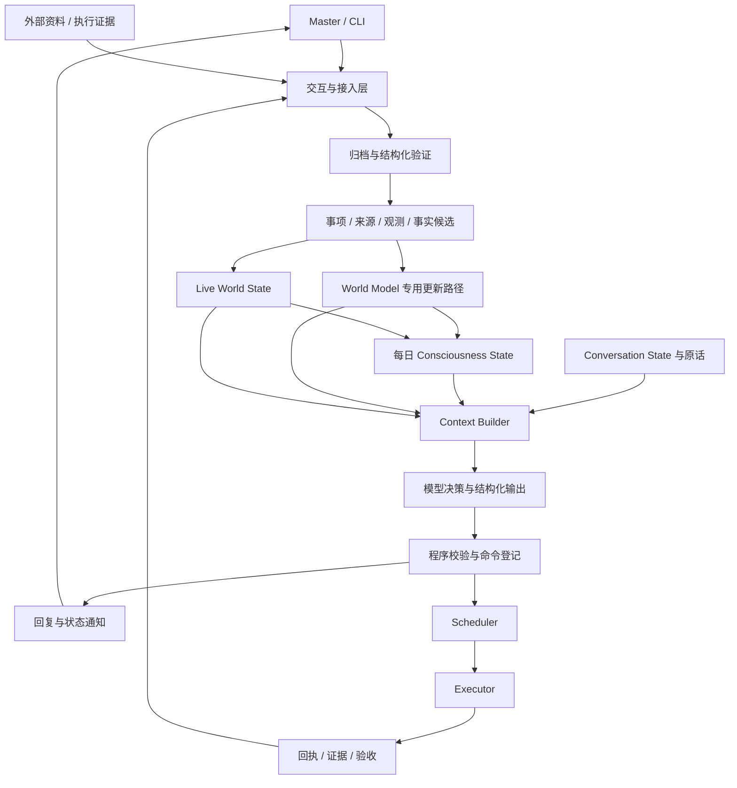

# Secretary_Simplified 整体设计

版本：1.0；日期：2026-09-14；状态：实施设计基线。

## 1. 目标

Secretary 是服务于 Master 的持续运行助手。它在会话之间保留可追溯的事实、事项、承诺和执行进度，用有限上下文恢复当前工作的连续性，并可靠执行即时或定时任务。这里的意识状态是工程上的认知摘要与注意力组织，不表示主观意识，也不承担事实存储职责。

本版先在 Mac 上实现 Go Core、Scheduler、Executor 和交互 CLI。SQLite 保存结构化数据，受控文件目录保存原文和产物。语音和移动设备按后续阶段接入；首版不要求 Mac 图形界面。

## 2. 业务范围

覆盖工作、个人项目、学校、生活四个领域。领域是事项的分类字段，允许以后登记新领域，不能形成四套互不兼容的流程。

| 能力 | 初版行为 | 后续演进 |
|---|---|---|
| 事项与承诺 | 创建、查询、修订、改期、取消、关联依赖和验收条件 | 按真实来源优化类型 |
| 连续对话 | 保留原话、指代、待答问题；跨重启恢复；检索历史 | 语音轮次与移动端 |
| 长期认知 | 有证据的事实与偏好；支持纠正、冲突、撤回 | 更丰富的实体关系 |
| 实时认知 | 当前事项、执行进度、来源和设备新鲜度 | 真实设备与更多源 |
| 执行 | 即时、单次定时、固定间隔、日历周期、事件触发；取消与有限重试 | 更多已登记能力 |
| 提醒与晨报 | CLI 通知、文字晨报；本地提醒路径和静音测试适配器 | 阶段 4 实际叫醒；阶段 5 语音晨报 |
| 数据接入 | 阶段 1—3 合成适配器和测试目录 | 阶段 4 GitHub、Canvas、指定文件库，逐一接入 |

初版不实现通用多 agent 平台、分布式数据库、自动软件开发平台、全时录音、生命体征或金融操作。内置 agent 是受限任务执行器，用于资料提取、晨报、认知整理和 World Model 修改提案，不是对宿主机无限制操作的主体。

## 3. 抽象架构

持久状态是权威来源，模型输出是待验证提案。Scheduler 负责何时执行，Executor 负责如何执行，Core 负责语义理解、事实准入和业务验收。模型生成的回复、执行成功和业务目标完成是三个不同的结果。

## 4. 四层记忆与 Context

| 层 | 保存内容 | 更新时机 | 权威边界 |
|---|---|---|---|
| World Model | 长期事实、偏好、项目背景、实体关系和冲突 | 有证据的更新任务完成时 | 当前准入事实；保留版本与依据 |
| Live World State | 当前事项、来源新鲜度、设备观测、执行与待处理状态 | 接入、业务修改、回执及读取时 | 当前业务记录及有时效的观测投影 |
| Consciousness State | 关注目标、优先事项、未闭环承诺、重要变化和不确定性 | 每 24 小时一个更新槽 | 可重建的派生快照 |
| Conversation State | 有界近期原话、历史摘要、指代、待答问题、事项引用 | 每轮输入及按压力整理 | 原话是证据，摘要是派生材料 |

Context 是上述内容针对一次模型调用的只读、有界组装结果，不是 Conversation State 的别名。它必须包含本次输入、当前时间、相关权威版本、可用能力、输出 Schema 和回复／任务请求分流规则。意识快照在一天内不反复重写，当天变化由当前投影和快照之后的增量补入。详见 [MemoryPolicy.md](MemoryPolicy.md)。

## 5. 必须保持的不变量

1. 同一输入重试、同一意图重复推理和服务重启都不得重复创建相同任务。
2. 任务状态、事实状态和来源新鲜度不由摘要反向覆盖。未知、冲突、撤回和资料未装入 Context 必须可区分。
3. World Model 所有写入经过专用更新能力，验证执行身份、范围、证据和预期版本。模型自报授权无效。
4. 业务修改、对应事件及请求回执在同一 SQLite 事务提交。跨进程通知只加速工作，持久队列和游标决定恢复行为。
5. 外部结果未知时先对账；没有幂等或可核验保证的副作用不能盲目重试。
6. 业务完成条件在委托接受时固定；执行器不能降低条件来宣布完成。
7. 已登记的本地提醒、停止与延后无需文字模型、Core 或语音模型在线；宿主机睡眠、关机和未登录另有物理限制。
8. 队列、检索、上下文、重试、模型调用、因果触发均有上限，重启不清空已消耗预算。
9. 可扩展字段必须可验证、可迁移、可拒绝；不得用任意 JSON 隐藏状态、权限或调度语义。

## 6. 自主实施边界

本设计把常规技术选择、数据契约和验收标准前置，使阶段 1—3 不依赖 Master 持续介入。实施 agent 需独立运行检查、阅读失败证据并复核最终改动。涉及真实账户授权、实际提醒时间、私人资料发送给模型、语音试听和移动设备配对时，再按路线图取得实际输入。

文档与自审能降低实现歧义，但不能证明运行时无故障，也不能代替阶段 4 的真实长期使用。阶段 3 的目标是可恢复、可检验的功能闭环，阶段 4 的目标才是观察真实数据和长期认知稳定性。
