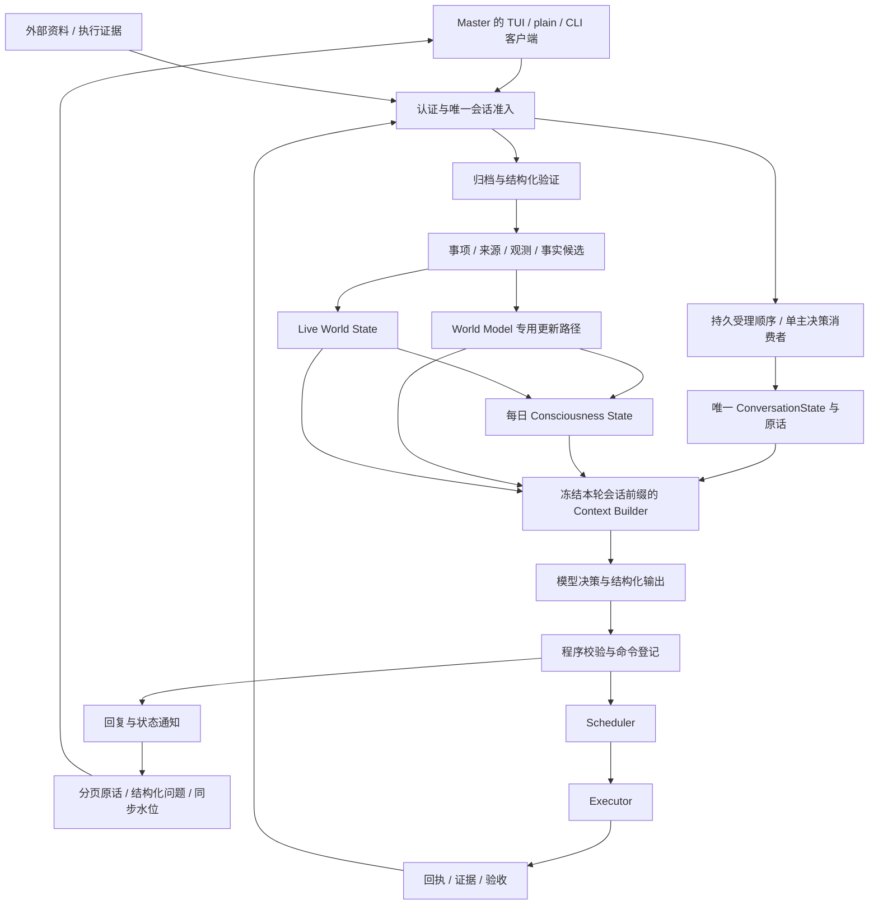

# Secretary_Simplified 整体设计

版本：1.1.1；日期：2026-09-14；状态：Issue #2 架构加 Issue #3 提交/观察及面板刷新局部修订。唯一权威会话、后端与数据模型不变，当前验收仅 R1/R2、DOC-R、BUILD-R；细则见 SingleConversationTUI 与 Acceptance。

## 1. 目标

Secretary 是服务于 Master 的持续运行助手。同一正式实例只有一个后端登记的可写权威会话；多个获准客户端是同一秘书的输入和显示终端，连接、断开、重启或换设备不产生认知分支。服务端统一维护原话、摘要、焦点、待答问题、事实、事项和意识，用有界 Context 恢复连续性并执行任务。这里的意识状态是工程认知摘要，不表示主观意识，也不承担事实存储职责。

本版在 Mac 上以 Go Core、Scheduler、Executor 和会话式 TUI 提供交互，保留 plain chat、命令式 CLI 与 JSON 输出。SQLite 保存权威结构化数据，客户端只持有草稿、滚动位置和同步游标，不自行汇总或上传主历史。语音和移动联网后置；本轮两个本机客户端接同一后端，不实现分布式多写或独立聊天会话。

## 2. 业务范围

覆盖工作、个人项目、学校、生活四个领域。领域是事项的分类字段，允许以后登记新领域，不能形成四套互不兼容的流程。

| 能力 | 初版行为 | 后续演进 |
|---|---|---|
| 事项与承诺 | 创建、查询、修订、改期、取消、关联依赖和验收条件 | 按真实来源优化类型 |
| 连续对话 | 保留原话、指代、待答问题；跨重启恢复；检索历史 | 语音轮次与移动端 |
| 长期认知 | 有证据的事实与偏好；支持纠正、冲突、撤回 | 更丰富的实体关系 |
| 实时认知 | 当前事项、执行进度、来源和设备新鲜度 | 真实设备与更多源 |
| 执行 | 即时、单次定时、固定间隔、日历周期、事件触发；取消与有限重试 | 更多已登记能力 |
| 提醒与晨报 | CLI 通知、文字晨报；本地提醒路径和静音测试适配器 | 阶段 4 实际叫醒；阶段 5 语音晨报 |
| 数据接入 | 阶段 1—3 合成适配器和测试目录 | 阶段 4 GitHub、Canvas、指定文件库，逐一接入 |

初版不实现通用多 agent 平台、分布式数据库、自动软件开发平台、全时录音、生命体征或金融操作。内置 agent 是受限任务执行器，用于资料提取、晨报、认知整理和 World Model 修改提案，不是对宿主机无限制操作的主体。

## 3. 抽象架构

持久状态是权威来源，模型输出是待验证提案。Scheduler 负责何时执行，Executor 负责如何执行，Core 负责语义理解、事实准入和业务验收。模型生成的回复、执行成功和业务目标完成是三个不同的结果。

## 4. 四层记忆与 Context

| 层 | 保存内容 | 更新时机 | 权威边界 |
|---|---|---|---|
| World Model | 长期事实、偏好、项目背景、实体关系和冲突 | 有证据的更新任务完成时 | 当前准入事实；保留版本与依据 |
| Live World State | 当前事项、来源新鲜度、设备观测、执行与待处理状态 | 接入、业务修改、回执及读取时 | 当前业务记录及有时效的观测投影 |
| Consciousness State | 关注目标、优先事项、未闭环承诺、重要变化和不确定性 | 每 24 小时一个更新槽 | 可重建的派生快照 |
| Conversation State | 有界近期原话、历史摘要、指代、待答问题、事项引用 | 每轮输入及按压力整理 | 原话是证据，摘要是派生材料 |

Context 是上述内容针对一次模型调用的只读、有界组装结果，不是 Conversation State 的别名。它必须包含本次输入、当前时间、相关权威版本、可用能力、输出 Schema 和回复／任务请求分流规则。意识快照在一天内不反复重写，当天变化由当前投影和快照之后的增量补入。详见 [MemoryPolicy.md](MemoryPolicy.md)。

## 5. 必须保持的不变量

1. 同一输入重试、同一意图重复推理和服务重启都不得重复创建相同任务。
2. 任务状态、事实状态和来源新鲜度不由摘要反向覆盖。未知、冲突、撤回和资料未装入 Context 必须可区分。
3. World Model 所有写入经过专用更新能力，验证执行身份、范围、证据和预期版本。模型自报授权无效。
4. 业务修改、对应事件及请求回执在同一 SQLite 事务提交。跨进程通知只加速工作，持久队列和游标决定恢复行为。
5. 外部结果未知时先对账；没有幂等或可核验保证的副作用不能盲目重试。
6. 业务完成条件在委托接受时固定；执行器不能降低条件来宣布完成。
7. 已登记的本地提醒、停止与延后无需文字模型、Core 或语音模型在线；宿主机睡眠、关机和未登录另有物理限制。
8. 队列、检索、上下文、重试、模型调用、因果触发均有上限，重启不清空已消耗预算。
9. 可扩展字段必须可验证、可迁移、可拒绝；不得用任意 JSON 隐藏状态、权限或调度语义。
10. 权威 session_id 由后端登记，所有公共主对话写入口验证它；客户端身份不是会话分区或权限。request_id、turn_id、task_id/run_id 保持各自作用。
11. 后端按持久受理序号逐轮主决策，模型调用在写事务外；后到未处理输入不进入前轮 Context 或摘要。允许后台 Runner 继续执行，不把全系统串行化。
12. 客户端断开不取消已受理业务；停止观察与取消指定 Task 不同。重连按原实例、请求和日志水位恢复，不重发新 ID，不创建会话。

新增行为、迁移边界、图表及本轮验收详见 [SingleConversationTUI.md](SingleConversationTUI.md)。本轮只执行 AUTH/TUI/DOC/BUILD 定向标准；旧上下文、持久性与长时报告是历史证据，不重跑、不改写。

## 6. 自主实施边界

本设计把常规技术选择、数据契约和验收标准前置，使阶段 1—3 不依赖 Master 持续介入。实施 agent 需独立运行检查、阅读失败证据并复核最终改动。涉及真实账户授权、实际提醒时间、私人资料发送给模型、语音试听和移动设备配对时，再按路线图取得实际输入。

文档与自审能降低实现歧义，但不能证明运行时无故障，也不能代替阶段 4 的真实长期使用。阶段 3 的目标是可恢复、可检验的功能闭环，阶段 4 的目标才是观察真实数据和长期认知稳定性。
